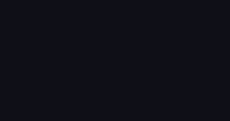

# HostsGuard


> Real-time network privacy manager for Windows. Monitor DNS activity, manage your hosts file, control Windows Firewall rules, and block unwanted connections.




## Quick Start

```bash
git clone https://github.com/SysAdminDoc/HostsGuard.git
cd HostsGuard
python HostsGuard.py  # Auto-installs dependencies, requests admin elevation
```

**Requirements:** Python 3.8+, Windows 10/11, Administrator privileges

Dependencies (`PyQt5`, `psutil`) are auto-installed on first run. No manual setup needed.

## Features

### Hosts Activity Tab

| Feature | Description |
|---------|-------------|
| DNS Cache Monitor | Polls Windows DNS client cache every 3 seconds, surfaces new domains in real-time |
| Domain Blocking | Block individual domains or entire root domains via hosts file (`0.0.0.0` entries) |
| Domain Allowing | Whitelist domains to exclude them from blocking |
| Hide / Hide Root | Permanently suppress domains from the activity feed — persists across restarts via `hidden_roots` table |
| Feed Tracking | Records first seen, last seen, hit count, and originating process for every domain |
| Status Filtering | Filter by All, Blocked, Allowed, Unmanaged, or Hidden |
| Bulk Actions | Multi-select domains for batch block, allow, or hide operations |
| Research Links | Right-click any domain to open Google, VirusTotal, who.is, URLScan, Shodan, SecurityTrails, MXToolbox, or AbuseIPDB |

### FW Activity Tab

| Feature | Description |
|---------|-------------|
| Live Connections | Real-time view of all outbound TCP/UDP connections via `psutil` |
| FW Status Overlay | Each connection shows whether it's blocked by hosts file, firewall, or neither |
| Process Identification | Shows process name, PID, remote port, country code, and traffic category |
| Quick FW Blocking | Block any IP (outbound, inbound, or both) or program directly from the connection list |
| Custom Rules | Create fully customized Windows Firewall rules with direction, action, protocol, address, and program |
| Learning Mode | Prompts on first connection from unknown processes — trust, untrust, or investigate |
| GeoIP Lookup | Resolves remote IPs to country codes via ip-api.com with LRU caching |

### Hosts File Tab

| Feature | Description |
|---------|-------------|
| Managed Domains | Database-backed domain management with status, source, hit tracking, and notes |
| Raw Editor | Direct editing of `C:\Windows\System32\drivers\etc\hosts` with syntax awareness |
| Clean & Save | Deduplicates, validates, and normalizes hosts entries in one click |
| Backup / Restore | Timestamped backups in `%APPDATA%\HostsGuard\backups\` with one-click restore |
| Emergency Reset | Resets hosts file to Windows defaults if something goes wrong |
| Blocklist Import | Import from 12+ community blocklists across ads, tracking, malware, and privacy categories |
| Paste Import | Bulk-add domains from clipboard (one per line) to hosts file or database |

### FW Rules Tab

| Feature | Description |
|---------|-------------|
| Full Rule Viewer | Lists all Windows Firewall rules with name, direction, action, protocol, remote address, and program |
| HG Prefix Tracking | HostsGuard-created rules use `HG_` prefix for easy identification and management |
| Quick Block Buttons | Block IP Out, Block IP In+Out, Block Program — instant rule creation |
| Change Action | Right-click any rule to toggle between Block and Allow |
| Enable / Disable | Toggle rules on/off without deleting them |
| Profile Management | Enable all firewall profiles (Domain, Public, Private) with one click |
| Bulk Delete | Remove all HostsGuard-created rules at once |
| Persistent State | FW rules tracked in database for recovery after system changes |

### Tools Tab

| Feature | Description |
|---------|-------------|
| Connection History | SQLite-backed log of all observed connections with search and export |
| Event Log | Chronological log of all block, allow, and firewall actions |
| Statistics Dashboard | Blocked count, allowed count, feed total, today's hits, top blocked domains |
| DNS Flush | One-click `ipconfig /flushdns` |
| Network Reset | Winsock reset, IP release/renew |
| Database Sync | Manual hosts-to-DB synchronization |
| Export | Export connection history and domain lists to CSV |

### System Features

| Feature | Description |
|---------|-------------|
| System Tray | Minimize to tray with desktop notifications for blocked domains |
| Persistent PowerShell | Keeps a single `powershell.exe` session alive — eliminates ~200ms spawn overhead per command |
| Parallel Startup | Database, hosts file, and connection DB load in a background thread behind a splash screen |
| Bandwidth Monitor | Real-time upload/download rates in the title bar via `psutil.net_io_counters` |
| DPI Aware | Scales all UI elements for high-DPI displays |
| Auto-Elevation | Requests UAC admin privileges on launch (required for hosts file and firewall access) |
| File Logging | Errors logged to `%APPDATA%\HostsGuard\hostsguard.log` (500KB rotating) |

## Blocklist Sources

Importable directly from the Hosts File tab:

| Category | Lists |
|----------|-------|
| **Popular** | HaGezi Ultimate, StevenBlack Unified, OISD Full, HOSTShield Combined |
| **Ads & Tracking** | Disconnect Tracking, Disconnect Ads |
| **Malware** | URLhaus, abuse.ch, Phishing Army |
| **Privacy** | First-Party Trackers (HaGezi), NoTracking |
| **Social** | StevenBlack Facebook |

## How It Works

```
┌──────────────────┐     ┌──────────────────┐     ┌──────────────────┐
│  DNS Cache Poll   │────>│   Feed Database   │────>│  Hosts Activity   │
│  (3s interval)    │     │   (SQLite WAL)    │     │  Tab (real-time)  │
│  via PowerShell   │     │                  │     │                  │
└──────────────────┘     └──────────────────┘     └──────────────────┘
                                │
                                │ sync
                                ▼
┌──────────────────┐     ┌──────────────────┐     ┌──────────────────┐
│  Hosts File       │<───│  Domain Manager   │────>│  Hosts File Tab   │
│  (0.0.0.0 entries)│     │  (block/allow/    │     │  (editor + lists) │
│                  │     │   hide/root)      │     │                  │
└──────────────────┘     └──────────────────┘     └──────────────────┘

┌──────────────────┐     ┌──────────────────┐     ┌──────────────────┐
│  psutil           │────>│  Connection DB    │────>│  FW Activity Tab  │
│  net_connections  │     │  (SQLite WAL)     │     │  (live view)      │
│  (2s interval)    │     │                  │     │                  │
└──────────────────┘     └──────────────────┘     └──────────────────┘
                                                          │
                                                          │ block
                                                          ▼
                                                  ┌──────────────────┐
                                                  │  Windows Firewall │
                                                  │  (NetFirewallRule)│
                                                  │  via PowerShell   │
                                                  └──────────────────┘
```

### Thread Architecture

| Thread | Type | Purpose | Interval |
|--------|------|---------|----------|
| DNSMonitor | QThread | Polls `Get-DnsClientCache` via persistent PS session | 3s |
| ConnWorker | QThread | Scans `psutil.net_connections()` | 2s |
| HostsWatcher | QThread | Watches hosts file mtime for external changes | 3s |
| DNSResolveWorker | QThread | Background reverse DNS lookups | On demand |
| GeoWorker | QThread | Background GeoIP lookups via ip-api.com | On demand |
| FWLoadWorker | QThread | Loads all firewall rules (dedicated subprocess) | On demand |
| PersistentPS | subprocess | Long-lived PowerShell session for fast command execution | Persistent |

## Configuration

All data is stored in `%APPDATA%\HostsGuard\`:

| File | Purpose |
|------|---------|
| `hostsguard.db` | Domain management, feed, event log, FW state (SQLite WAL) |
| `connections.db` | Connection history (SQLite WAL) |
| `config.json` | Learning mode, trusted/untrusted processes, notification settings |
| `hostsguard.log` | Error log (500KB rotating, 1 backup) |
| `backups/` | Timestamped hosts file backups |
| `favicons/` | Cached site favicons for domain table display |

## FAQ / Troubleshooting

**Q: The app requests admin privileges. Why?**
Writing to `C:\Windows\System32\drivers\etc\hosts` and creating Windows Firewall rules both require administrator access. HostsGuard auto-elevates via UAC on launch.

**Q: DNS monitoring shows "Requires Windows"**
The DNS cache monitor uses `Get-DnsClientCache` which is Windows-only. Connection monitoring via `psutil` works on all platforms, but the hosts file path and firewall features are Windows-specific.

**Q: Managed Domains tab is empty**
Click the **Refresh** button or switch away and back — the first load runs an async sync from the hosts file to the database. If you have a large hosts file (100k+ entries), the initial sync may take a few seconds.

**Q: I blocked a domain but it still resolves**
Run `ipconfig /flushdns` (available in the Tools tab) or wait for the DNS cache to expire. Some applications maintain their own DNS cache separate from the OS.

**Q: How do I undo everything?**
Hosts File tab → **Restore** restores the most recent backup. **Emergency Reset** rewrites the hosts file to Windows defaults. FW Rules tab → **Delete All HG** removes all HostsGuard-created firewall rules.

**Q: Can I run this headless / via CLI?**
Not currently — HostsGuard is a GUI application. For automation, consider using the hosts file and firewall PowerShell commands directly.

## License

MIT License — see [LICENSE](LICENSE) for details.

## Contributing

Issues and PRs welcome. If reporting a bug, include `%APPDATA%\HostsGuard\hostsguard.log` contents.
