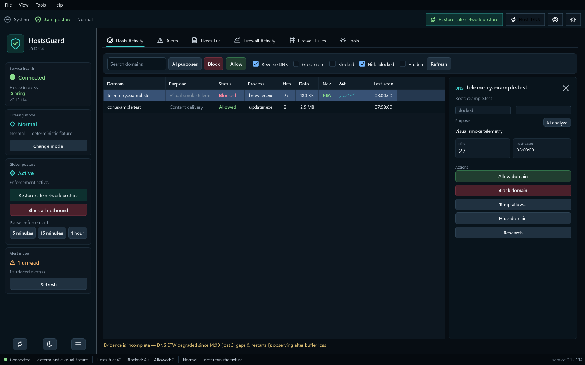
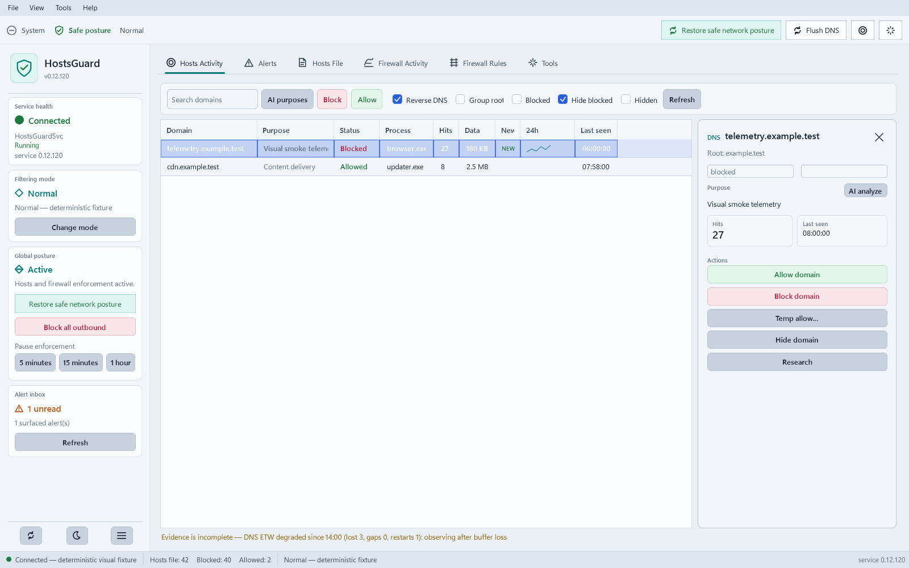

# HostsGuard


> Real-time network privacy manager for Windows. Monitor DNS activity, manage your hosts file, control Windows Firewall rules, consent-prompt on new outbound connections, and block unwanted traffic — all local, zero telemetry.

## Screenshots

Live DNS activity feed with the concept-style status rail, native themed window chrome, icon-led navigation, dense activity table, selected-row inspector, per-root 24h sparklines, and the `field:value` search DSL - dark and light themes:





## Architecture

HostsGuard is a **split-trust, two-process** application built on .NET 10 (LTS):

```
┌───────────────────────────────┐      gRPC over Named Pipe        ┌────────────────────────────────────┐
│  HostsGuard.App (WPF)         │  (ACL'd pipe, per-session        │  HostsGuard.Service (LocalSystem)  │
│  UNELEVATED desktop UI        │◄────token authentication)───────►│  Windows Service — owns ALL        │
│  tray · dashboards · prompts  │   unary + server-streaming       │  privileged mutation               │
└───────────────────────────────┘                                  │  · hosts file (transactional)      │
                                                                   │  · Windows Firewall COM rules      │
┌───────────────────────────────┐      same contract               │  · ETW DNS / IPHLPAPI connections  │
│  HostsGuard.Cli               │─────────────────────────────────►│  · tamper watch · scheduler        │
│  block/allow/status/export…   │                                  │  · SQLite (ProgramData)            │
└───────────────────────────────┘                                  └────────────────────────────────────┘
```

The elevated logic lives in a LocalSystem service that starts with the OS, so the UI **never needs UAC**, mutation is centralized and auditable, tamper self-heal runs even when nobody is logged in, and every OS call is a typed Windows API (Firewall COM, ETW, IPHLPAPI) instead of a parsed subprocess.

## Install

1. Download the `win-x64` or `win-arm64` `HostsGuard-vX.Y.Z-<rid>-dotnet-Setup.exe` from [Releases](https://github.com/SysAdminDoc/HostsGuard/releases).
2. Run it (the installer elevates once to register the `HostsGuardSvc` service; the app itself runs unelevated).
3. Launch **HostsGuard** from the Start menu or tray.

**Requirements:** Windows 10/11, x64 or ARM64. The service depends on the Windows Firewall service (MpsSvc). Uninstall stops the service, restores your default firewall posture, and removes all `HG_` rules.

### Migrating from the Python build (v3.x)

`HostsGuard.Migrator.exe` performs a one-shot import of a Python-era profile — `hostsguard.db` (domains, feed, event log, profiles, firewall state), `config.json` (schedules, allowlists, DoH state, learning trust sets), and `doh_resolvers.json` — into the new schema. `HG_` firewall rules are re-discovered live via COM and carry over automatically. The migration is idempotent and supports `--dry-run`.

The final Python build (v3.17.0) is preserved at the [`python-eol`](https://github.com/SysAdminDoc/HostsGuard/releases/tag/python-eol) tag.

## Features

### Consent prompts (ask-to-connect)

| Feature | Description |
|---------|-------------|
| Filtering modes | **Normal** (enforce silently), **Notify** (prompt on new outbound connections), **Learning** (auto-allow and record) — switchable from the tray |
| Consent window | Top-most prompt on blocked outbound attempts with process path, signer, resolved hostname, GeoIP country, threat-intel verdict, and domain purpose |
| Scope + duration | Allow/block by program, remote IP, or port — permanently or for a limited time window |
| Known-safe baseline | OS-essential binaries (Windows Update, Defender, kernel, LSA) are auto-allowed so prompts target interesting traffic |
| Identity-bound rules | Rules record the binary's SHA-256 and signer; a renamed impostor at a whitelisted path is re-prompted, while an auto-updater moving to a new versioned directory is recognized as the same app |
| Trust publisher / folder | Auto-allow future software signed by a trusted Authenticode publisher, or any binary under a trusted install folder — opted in from the prompt |
| Inbound consent | Opt-in prompting on unruled **inbound** connections too, producing scoped inbound rules (off by default to avoid unsolicited-inbound noise) |
| Decision history | Every consent decision is recorded and reviewable |
| Posture rails | Arming Notify/Learning sets default-outbound Block per profile; the prior posture is restored on switch back to Normal and on service stop |
| Accessibility | Full AutomationProperties coverage, explicit tab order, live-region threat banner, keyboard/screen-reader focus management |

### Hosts Activity

| Feature | Description |
|---------|-------------|
| Real-time DNS feed | ETW `Microsoft-Windows-DNS-Client` events surface domains as they resolve — no polling |
| Domain blocking | Block individual domains or entire root domains via hosts file (`0.0.0.0` entries) |
| Domain purpose | Curated offline domain→purpose annotations ("Microsoft telemetry", "Akamai CDN", "Google Analytics") inline in the feed and on prompts |
| 24h sparkline | Per-root hourly hit rollup rendered as an inline activity sparkline |
| Temp allow | Allow a domain for 15 minutes / 1 hour / 8 hours, automatically reverted to blocked |
| Hide / hide root | Suppress domains from the activity feed, persistent across restarts |
| Advanced search | `field:value`, `!term`, and `field!=value` filters across all tables |
| Research links | Right-click any domain to open Google, VirusTotal, who.is, and more |

### FW Activity

| Feature | Description |
|---------|-------------|
| Live connections | Real-time outbound TCP/UDP view via IPHLPAPI extended tables (PID-attributed, no elevation needed) |
| Group by app + search | Collapsible per-process grouping with a `field:value` search DSL (`port:443 country!=US`, `fw:threat`) |
| Service attribution | svchost-hosted connections show the responsible Windows service (SCM enumeration) |
| Blocked-connection watch | Security event log 5157/5152 detection feeds the consent broker |
| Status overlay | Each connection shows blocked-by-hosts/firewall/threat, plus **DIRECT-IP** for raw-IP dials with no preceding DNS lookup |
| Quick blocking | Block any remote IP or program, or scope-block a program to Internet / LAN / localhost / inbound |
| GeoIP + threat intel | Offline MMDB country/ASN resolution plus URLhaus/Feodo known-bad overlay |
| Connection history | Retention-bounded searchable log of past connections (default 30 days) |
| Per-app bandwidth | Top-5 per-process bandwidth timeline via ETW kernel byte counters |
| Explain / look up connection | Right-click a connection to show the ordered hosts/firewall/trust/profile/kill-switch decision chain, or look it up on VirusTotal, who.is, Google, and AbuseIPDB |
| Learning review | Batch-promote, reverse, or discard Learning-mode auto-decisions |

### Hosts File

| Feature | Description |
|---------|-------------|
| Managed domains | Database-backed domain management with status, source, hit tracking, and canonical reasons |
| Raw editor | Direct editing of `drivers\etc\hosts` with clean-and-save (dedupe, validate, normalize) |
| Backup / restore | Timestamped backups with one-click restore and emergency reset to Windows defaults |
| Blocklist import | 12+ curated community blocklists (HaGezi, StevenBlack, OISD, URLhaus, ...) with preview, enable/disable, source-scoped rollback, and allowlist-wins merge |
| Allowlist subscriptions | Remote allowlists that whitelist domains and win over blocklists |
| Blocked services | One-click toggles to block YouTube, TikTok, Facebook, Discord, Netflix, and more |
| Telemetry preset | One-click block of ~28 Microsoft telemetry endpoints, reversible as a unit |
| Tamper watch | SHA-512 integrity tracking distinguishes HostsGuard's writes from external ones; optional auto-restore |

### FW Rules

| Feature | Description |
|---------|-------------|
| Full rule viewer | All Windows Firewall rules with name, direction, action, protocol, address, and program |
| `HG_` prefix tracking | HostsGuard-created rules are identifiable and bulk-manageable |
| Secure Rules guard | Opt-in tamper-guard: the service recreates or re-enables any `HG_` rule deleted or disabled behind its back (only HostsGuard's own rules — your other configuration is never touched) |
| Orphan detection + rebind | Flags program rules whose executable moved and suggests signed identity matches with a preview before re-bind |
| Rule groups | Assign `HG_` rules to a named group and toggle the whole group on/off atomically; groups round-trip through the portable policy |
| Rule authoring | Custom rules with direction, action, protocol, address, and program — COM API, no PowerShell shelling |

### Tools

| Feature | Description |
|---------|-------------|
| DNS-bypass defenses | Block QUIC/UDP-443, block known DoH bootstrap resolvers, and DoT/DoQ port 853 (your own resolver exempt) so apps can't tunnel DNS past hosts blocking |
| CNAME-cloak guard | Opt-in reactive block of first-party hosts that resolve via CNAME to a blocked tracker |
| DNS resolver switcher | One-click switch to Cloudflare, Google, Quad9, AdGuard DNS, or NextDNS + DNS flush |
| DoH intelligence | Refreshable, SHA-256-verified DoH resolver list merged with Windows known servers |
| Scheduled blocking | Block a domain, service, or **firewall rule** (`fw:` target) on a recurring weekly schedule (windows may cross midnight) |
| Network profiles | Save/switch named rule sets, with **automatic switching** by joined-network fingerprint (gateway MAC) |
| Settings lock | Password-lock mode/posture/rule changes with an optional timed unlock; one-click hosts-file write protection |
| Global outbound | Tray Block-all / Allow-all outbound posture selector (no restart) |
| VPN kill-switch | Watch a chosen VPN adapter; force default-outbound Block on every profile whenever it drops so nothing leaks outside the tunnel, restored on reconnect (opt-in) |
| Loopback API | Opt-in (`HG_LOOPBACK_API=1`) token-authed `127.0.0.1` JSON-RPC/OpenAPI surface |
| Event webhooks | Opt-in signed HTTPS POST of engine events (`X-HG-Signature` HMAC-SHA256, bounded retries), configured via the loopback API with public-endpoint SSRF validation |
| Portable policy | Export/import a versioned JSON policy carrying domains, firewall posture, schedules, profiles, consent trust sets, DNS privacy toggles, DoH intelligence, kill-switch intent, AI knowledge, user overrides, and webhook endpoint intent |
| Defender exclusion helper | Handles the `HostsFileHijack` false positive when blocking Microsoft telemetry |
| Support bundle | Redacted diagnostic zip — config, DB integrity, logs, event history, firewall summary (no tokens, webhooks, private domains, or remote IPs) |
| Event taxonomy | Structured, filterable event ledger of every block, allow, firewall, consent, DNS, list, support, and policy action; browsable in WPF and CLI with redacted CSV export |

### CLI

```
HostsGuard.Cli status
HostsGuard.Cli block <domain> [reason]
HostsGuard.Cli allow <domain> [reason]
HostsGuard.Cli unblock <domain>
HostsGuard.Cli explain <domain|ip|process|exe> [--program path] [--port N] [--proto tcp|udp]
HostsGuard.Cli export [path.json]
HostsGuard.Cli export-policy [path.json]
HostsGuard.Cli import-policy <path.json>
HostsGuard.Cli mode [normal|notify|learning]
HostsGuard.Cli events [--limit N] [--search text] [--category name] [--export events.csv]
HostsGuard.Cli blocklists [list|refresh|preview|import|disable|enable|remove]
HostsGuard.Cli release-smoke
```

The CLI talks to the service over the same authenticated pipe contract as the app, so it works unelevated too.

## Data locations

| Path | Purpose |
|------|---------|
| `%ProgramData%\HostsGuard\` | Policy state: `hostsguard.db` (SQLite WAL), consent state, DoH intelligence — DACL-locked to SYSTEM+Admins |
| `%APPDATA%\HostsGuard\` | Per-user UI settings (`config.json`: theme, UI scale) and logs |

## Building from source

```powershell
git clone https://github.com/SysAdminDoc/HostsGuard.git
cd HostsGuard
dotnet build HostsGuard.sln          # requires .NET 10 SDK
dotnet test HostsGuard.sln           # 811 tests, no elevation needed
powershell -NoProfile -ExecutionPolicy Bypass -File tools\package-hygiene.ps1
                                      # fails on vulnerable or undeferred stale NuGet packages
powershell -NoProfile -ExecutionPolicy Bypass -File tools\visual-smoke.ps1
                                      # offscreen rendered WPF dark/light smoke
build\publish.ps1 -AllRuntimes       # single-file self-contained win-x64/win-arm64 -> dist\dotnet\<rid>\
winget install --id JRSoftware.InnoSetup -e
& "C:\Program Files (x86)\Inno Setup 6\ISCC.exe" installer-dotnet.iss
& "C:\Program Files (x86)\Inno Setup 6\ISCC.exe" /DTargetRid=win-arm64 /DTargetArchitecturesAllowed=arm64 /DTargetInstallIn64BitMode=arm64 installer-dotnet.iss
# Produces installer_output/HostsGuard-v0.12.25-win-x64-dotnet-Setup.exe
#          installer_output/HostsGuard-v0.12.25-win-arm64-dotnet-Setup.exe
```

Solution layout: `HostsGuard.Core` (pure domain, no OS deps), `HostsGuard.Contracts` (gRPC protos), `HostsGuard.Windows` (Firewall COM / ETW / IPHLPAPI / ACL interop), `HostsGuard.Service` (elevated engine), `HostsGuard.App` (WPF UI), `HostsGuard.Cli`, `HostsGuard.Migrator`, plus per-project test suites under `tests/`.

## Security

The .NET engine pins its runtime and dependency posture:

- **Runtime servicing floor:** the solution targets **.NET 10 (LTS, supported to
  November 2028)** and builds resolve the latest servicing patch
  (`TargetLatestRuntimePatch`), so self-contained artifacts bundle a current
  runtime.
- **Dependency CVEs:** `dotnet list package --vulnerable --include-transitive`
  is kept clean. `tools\package-hygiene.ps1` is the local release ratchet: it
  fails on vulnerable packages, outdated direct packages, or new undeferred
  transitive drift while printing the current TraceEvent, SQLitePCLRaw,
  xUnit-runner, and UI-support deferral reasons. The native SQLite bundle is pinned to `SQLitePCLRaw.bundle_e_sqlite3`
  3.0.3 to clear GHSA-2m69-gcr7-jv3q (CVE-2025-6965); Google.Protobuf ≥ 3.35
  carries the recursion-depth fix; the .NET 10 SDK prunes framework-provided
  transitives, retiring the old test-only 4.3.0 floors.
- **Elevated surface:** the LocalSystem service's data directory
  (`%ProgramData%\HostsGuard`) is DACL-locked to SYSTEM+Admins before any state
  file is written; client blocklist and webhook URLs pass an SSRF guard
  (non-HTTPS, loopback/RFC1918/link-local/CGNAT/ULA/metadata rejected) before
  the service dials them; the gRPC control pipe is ACL'd and per-session-token
  authenticated.
- **Portable policy boundaries:** exported policies intentionally omit AI API
  keys and webhook signing secrets while preserving non-secret policy intent,
  including endpoints, enabled state, learned knowledge, and override rows; an
  import reports the omitted secrets so they can be re-entered on the target
  machine.

Report vulnerabilities via a GitHub issue with the redacted support bundle
(Tools → **Export Support Bundle**).

## FAQ / Troubleshooting

**Q: Does the app need admin privileges?**
No. The UI and CLI run unelevated; all privileged work happens in the `HostsGuardSvc` LocalSystem service that the installer registers (installation itself elevates once).

**Q: I blocked a domain but it still resolves**
Flush the DNS cache (Tools tab) or wait for the cache to expire. Some applications maintain their own DNS cache separate from the OS — the DNS-bypass defenses (QUIC block, DoH blocklist) close the common tunnels.

**Q: How do I undo everything?**
Hosts File tab → **Restore** restores the most recent backup; **Emergency Reset** rewrites the hosts file to Windows defaults; FW Rules tab → **Delete HG Rules** removes all HostsGuard-created firewall rules. Uninstalling does all of this automatically and restores your prior firewall posture.

**Q: Windows Defender flags the hosts file as a threat**
Blocking Microsoft telemetry domains causes Defender to report `SettingsModifier:Win32/HostsFileHijack`. This is a false positive — HostsGuard is modifying the hosts file intentionally. Add an exclusion for `C:\Windows\System32\drivers\etc\hosts`; HostsGuard warns before importing lists that trigger this.

**Q: What happened to the Python version?**
HostsGuard v3.x was a Python/PySide6 application. It was retired in favor of this .NET 10 rewrite, which removes PowerShell subprocess shelling (typed Windows APIs instead), runtime-only error surfacing (compiled core), and the 127 MB PyInstaller bundle (small self-contained binaries + a real Windows Service). The final Python build is preserved at the `python-eol` tag, and `HostsGuard.Migrator` imports v3.x profiles.

## License

MIT License — see [LICENSE](LICENSE) for details.

## Contributing

Issues and PRs welcome. If reporting a bug, attach the redacted support bundle (Tools → **Export Support Bundle**).
